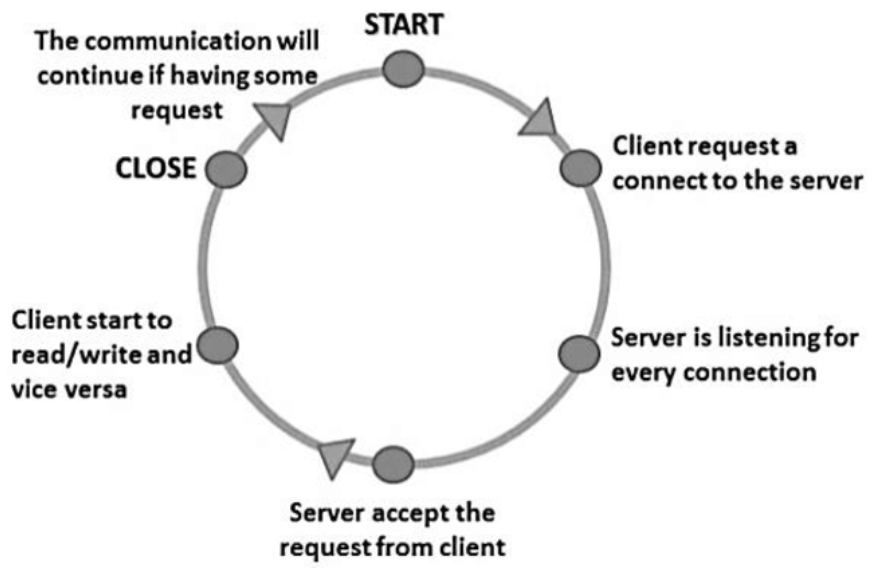

# city-explorer-api
# Project Name: weather forcasting

**Author**: Fatima Khwaileh
**Version**: 1.0.0 (increment the patch/fix version number if you make more commits past your first submission)

## Overview
In here, we are going to build our server to send the data for the lattitude and longitude from my server to the front end

## Getting Started
fisrt: i should create my own port and put it in the environment

Use strict

require the libraries, express,cors and dot env

trigger the express function and store it in a variable 

call the array of the weather

make send the data in the weather to the front end by get method
 
 also use listen method

## Architecture
 Bootstrap

 express

 dotenv

 cors

 
## Credit and Collaborations
Firas Yacoup

